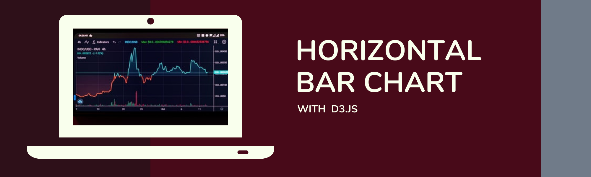
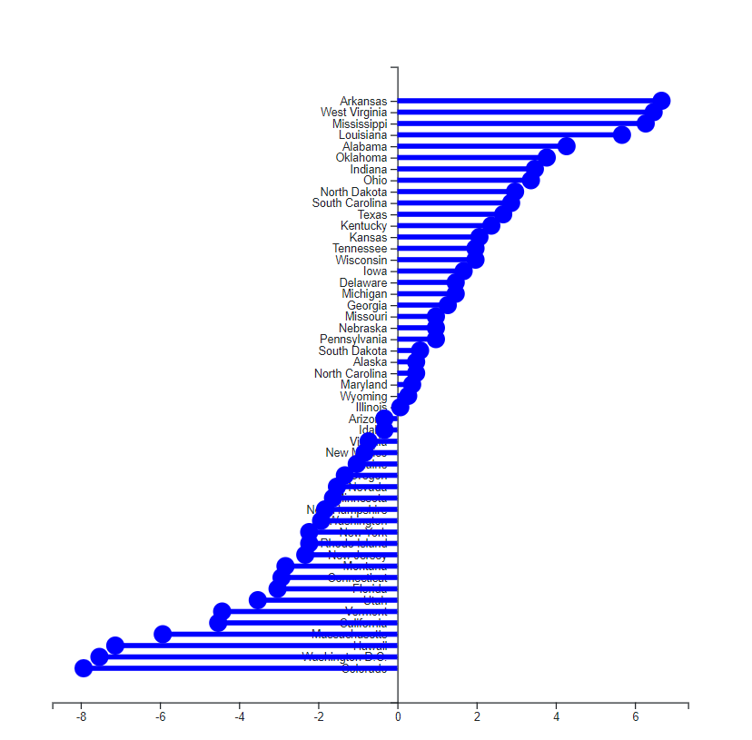

# d3-horizontal-bar-custom

Author:  Erin James Wills, ejw.data@gmail.com  

  
<cite>Photo by [Jack B](https://unsplash.com/@nervum?utm_source=unsplash&utm_medium=referral&utm_content=creditCopyText) on [Unsplash](https://unsplash.com/s/photos/candlestick-chart?utm_source=unsplash&utm_medium=referral&utm_content=creditCopyText)</cite>  

## Overview  

This repo uses d3.js to create a custom horizontal bar chart or sometimes called lollipop chart.  This was a weekend project that started with the code used in the [d3-scatter plot repo]() and modified the same data set to show differences from the average.  

   

## Technologies    
*  HTML/CSS/JS
*  D3.js

 

## Data Source  
I believe the original dataset came from Kaggle and was one of their Quality of Life datasets.  

 

## Setup and Installation  
1. Clone the repo to your local machine
1. Open repo folder in an IDE like VSCode
1. Using a virtual server like the VSCode extention LiveServer
1. Run `index.html`  

## Example

